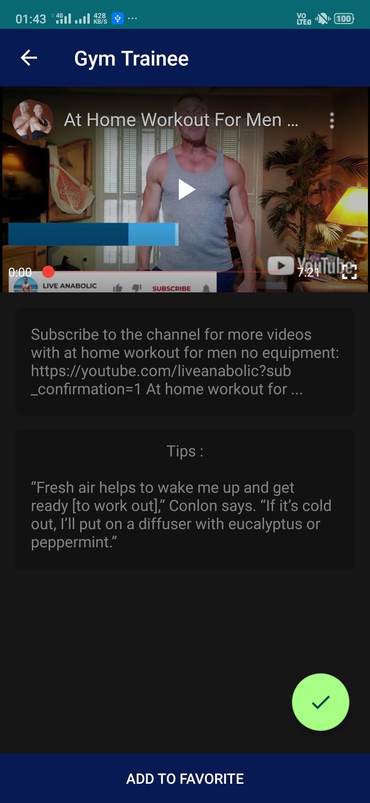

# GymTrainee
Gym Trainee provides customized workout videos which can be saved easily to watch further

GymTrainee is workout app that keeps you filtered Youtube workout videos. It helps you as a
trainer. The app contains a workout for Home as well as Gym. So you don’t need to ask for
someone’s assistant. One needs a solution.
The app have all types of workout like Full Body Workout, Abs Workout, Lower Body Workout,
Biceps & Triceps workout, Back workout, and all other necessary ones. You just have to watch
videos from the section and you’re done. You can save your workout too for later use.
When you’re done just click on the check button which keeps you motivated while doing the
workout.

### [DOWNLOAD THE GYMTRAINEE APP](https://drive.google.com/file/d/1FuhuIiYEtolQmS9yg3DFcO62DO6JOkDD/view?usp=sharing)

## Features
* Workout videos
* Save favorite workout videos
* Keep motivated with videos

## Library 
* Glide
* Room
* Retrofit
* RxJava
* Butterknife
* Youtube Player

## Screenshots
 
  

